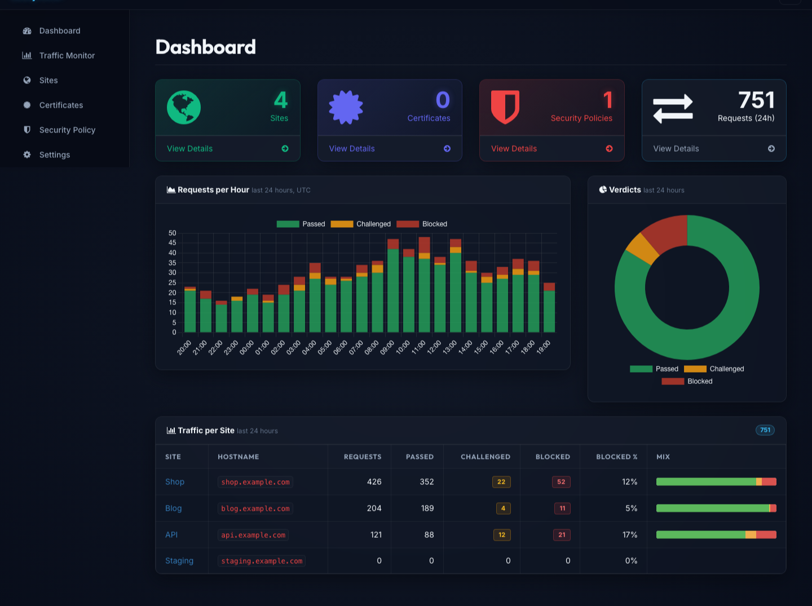

# EasyWAF

A self-contained web application firewall and HTTP reverse proxy, in a single Rust binary.

EasyWAF sits in front of your web applications, routes requests to the right backend by
`Host:` header, inspects them against OWASP-style rules, and blocks, challenges or forwards
them. Everything — virtual hosts, WAF policies, rules, traffic history — is managed from a
built-in web GUI and stored in one SQLite file. There is no separate database server, no
runtime dependency beyond glibc, and nothing to wire together.



*The dashboard: request volume over the last 24 hours split into passed, challenged and
blocked, with a per-site breakdown.*

---

## Status

Working today: reverse proxying, the rule engine, the CAPTCHA challenge, traffic logging and
retention, and the management GUI. Not yet implemented: **TLS termination** (the proxy serves
plain HTTP), **GeoIP rules** (the page is a stub) and **ACME**. See
[Not implemented yet](#not-implemented-yet) before deploying.

---

## How it works

```
                    ┌─────────────────────────────────────────┐
   client ────────► │ EasyWAF                                 │
                    │                                         │
                    │  1. match Host: against a site          │
                    │  2. pipeline: traffic log → WAF rules   │ ──► block  403
                    │  3. verdict: pass / challenge / block   │ ──► challenge (CAPTCHA)
                    │  4. forward, inject security headers    │
                    └──────────────────┬──────────────────────┘
                                       ▼
                                  upstream app
```

One process serves two things: the **management GUI** on `gui_port` (8080 by default), and one
**proxy listener per distinct site port**. Saving a site on a new port binds it immediately —
no restart. A request whose `Host:` matches no enabled site gets a 404.

A site with no WAF policy attached is simply a reverse proxy: traffic is forwarded and logged,
and the per-site security headers still apply, but nothing is inspected.

---

## Features

* **Virtual hosts** — route by `Host:` header to any upstream URL, one listener per port,
  bound dynamically as sites are added.
* **Rule engine** — 99 bundled OWASP-style rules across SQLi, XSS, LFI, RFI, RCE, PHP,
  protocol and scanner categories. Rules match a request zone (`URL`, `ARGS`, `BODY`,
  `HEADERS`, or `ANY`) and either add to a score or block outright.
* **Three enforcement modes per policy** — `Off`, `DetectionOnly` (log what would happen,
  block nothing) and `On`.
* **CAPTCHA challenge** — a middle ground between allow and block: suspicious-but-plausible
  traffic gets a self-hosted image CAPTCHA. Solving it sets a short-lived, IP-bound,
  HMAC-signed clearance cookie. No third-party service.
* **Traffic monitor** — every proxied request recorded with verdict, latency and status;
  filterable by site, verdict and time window, with a per-hour chart.
* **Dashboard** — request volume, a stacked passed/challenged/blocked chart over 24 hours,
  and a per-site breakdown.
* **Traffic retention** — bound the history from Settings; older events are pruned at startup
  and hourly.
* **Per-site security headers** — HSTS, `X-Frame-Options`, `X-Content-Type-Options`,
  `X-XSS-Protection`, toggled individually.
* **Light / dark / auto theme.**
* **Packaged** — `.deb` and `.rpm` for x86_64 and arm64, with a systemd unit.

---

## Install

Packages are published for **x86_64** and **arm64**; your package manager picks the right one.

**Debian / Ubuntu**

```bash
curl -fsSL https://repo.easysys.io/easywaf/stable/debian/key.gpg \
  | sudo gpg --dearmor -o /usr/share/keyrings/easysys.gpg
echo "deb [signed-by=/usr/share/keyrings/easysys.gpg] https://repo.easysys.io/easywaf/stable/debian ./" \
  | sudo tee /etc/apt/sources.list.d/easywaf.list
sudo apt update && sudo apt install easywaf
sudo systemctl enable --now easywaf
```

**RHEL / Fedora**

```bash
sudo tee /etc/yum.repos.d/easywaf.repo >/dev/null <<'EOF'
[easywaf]
name=EasyWAF
baseurl=https://repo.easysys.io/easywaf/stable/redhat
enabled=1
gpgcheck=1
gpgkey=https://repo.easysys.io/easywaf/stable/redhat/key.gpg
EOF
sudo dnf install easywaf
sudo systemctl enable --now easywaf
```

**openSUSE / SLES**

```bash
sudo zypper addrepo -fg https://repo.easysys.io/easywaf/stable/redhat easywaf
sudo zypper install easywaf
sudo systemctl enable --now easywaf
```

Or download a `.deb`/`.rpm` from the [releases page](https://github.com/easysysio/EasyWAF/releases).

The package installs the binary to `/usr/bin/easywaf` and its runtime files — templates,
static assets, bundled rule sets and `config.toml` — under `/opt/easywaf`, plus a systemd
unit. The database is created at `/opt/easywaf/easywaf.db` on first start. The service runs as
root so a site can bind a privileged port such as 80.

---

## First run

Open `http://<host>:8080/` and sign in with **admin** / **admin**.

> **Keep the management port private.** The first start seeds an `admin`/`admin` account and
> there is no password-change screen yet. Firewall port 8080 or bind it to a management
> network until that lands.

### Add a site

**Sites → Add site**:

| Field | Value | Notes |
|---|---|---|
| Hostname | `example.com` | The `Host:` header to route on — bare name, no scheme, no port |
| Upstream Target | `http://127.0.0.1:3000` | Where to forward — full URL including scheme |
| Listen Port | `80` | Bound immediately; the previously bound port keeps listening until restart |

### Attach a WAF policy

Under **Policies**, create a policy, choose its rule sets, and set the engine mode. A new
policy defaults to `DetectionOnly`, so nothing is blocked until you switch it to `On` — start
there, watch the Traffic Monitor, then enforce.

Each matching rule adds its **score**; when the total reaches the policy's score threshold
(10 by default) the request is blocked with 403. Six of the bundled rules are instant-block
regardless of score. If a challenge threshold is set, scores that reach it but stay under the
block threshold get a CAPTCHA instead.

Verify enforcement with a signature that always blocks:

```bash
curl -i "http://your-site/?q=xp_cmdshell"
# HTTP/1.1 403 Forbidden
# WAF block rule matched: SQLi: xp_cmdshell (MSSQL)
```

---

## Configuration

`config.toml` lives beside the binary's working directory — `/opt/easywaf/config.toml` for a
package install — and holds only what is needed before the database is open:

```toml
secret       = "change-this-to-a-random-secret-before-production"
database_url = "sqlite://easywaf.db"

[proxy]
gui_port = 8080
```

`secret` signs GUI session cookies and CAPTCHA clearance cookies — change it before
production. Restart to apply any edit.

Everything else — sites, their ports, policies, rules and retention — lives in the database
and is managed from the GUI, so adding a site never means editing a file.

The shipped file also carries `http_port`, `geoip_db` and `acme_webroot`. These are
placeholders for features that are not wired up and are ignored; the ports EasyWAF listens on
come from the sites you define.

---

## Build from source

Requires a stable Rust toolchain and `sqlite3`.

`sqlx`'s `query!` macros validate SQL against a real schema **at compile time**, so a database
must exist before you build. Apply the migrations first:

```bash
rm -f easywaf.db
for f in migrations/*.sql; do sqlite3 easywaf.db < "$f"; done
DATABASE_URL=sqlite://easywaf.db cargo build --release
```

Without `DATABASE_URL` the build fails with `unable to open database file` from inside the
macro expansion — that is a missing schema, not a broken source tree.

Run it from the repository root, since templates, static assets and rules are resolved
relative to the working directory:

```bash
DATABASE_URL=sqlite://easywaf.db ./target/release/easywaf
```

---

## Project layout

```
src/
  main.rs           entry point: GUI router, proxy spawn, retention task
  config.rs         config.toml loader
  db.rs             pool setup and migrations
  auth.rs           session cookie key
  challenge.rs      CAPTCHA generation and clearance cookies
  proxy/mod.rs      the reverse proxy: routing, pipeline, forwarding
  modules/          inspection pipeline
    waf.rs          rule evaluation, scoring, compiled-pattern cache
    traffic.rs      request logging and retention pruning
  routes/           GUI pages (dashboard, sites, policy, rules, traffic, certs, settings)
migrations/         schema, applied in order at startup
rules/              bundled OWASP-style rule sets (TOML)
templates/          Tera templates
static/             CSS and JS
packaging/          systemd unit
```

---

## Not implemented yet

Called out so nothing here is a surprise in production:

* **TLS / HTTPS** — the proxy serves plain HTTP. Certificates can be stored in the GUI but are
  not used to terminate TLS. Put EasyWAF behind a TLS terminator if you need HTTPS.
* **GeoIP rules** — the page is a placeholder; the `country` column is never populated.
* **ACME** — no automatic certificate issuance.
* **WebSockets** — the `Upgrade` header is stripped as hop-by-hop, so upgrades do not proxy.
* **Password change** — the admin password can only be changed in the database.
* **IPv6 literal hostnames** — host matching truncates at the first colon.

Request bodies are buffered up to 32 MB so rules can inspect them; larger requests are
rejected with 400. Responses are streamed.

---

## Releasing

Tagging `v*` triggers `.github/workflows/release.yml`, which builds `.deb` and `.rpm` for both
architectures and publishes a GitHub Release with the notes from the matching `CHANGELOG.md`
section. Running the workflow manually builds packages only, versioned
`X.Y.Z+ci<run>.git<sha>` for the testing channel. Packages are pulled into the public
repositories by `github2repo.sh` in the EasyWAF-repo project.

---

## License

GPL-3.0. Documentation at [easysys.io/easywaf](https://easysys.io/easywaf/).
