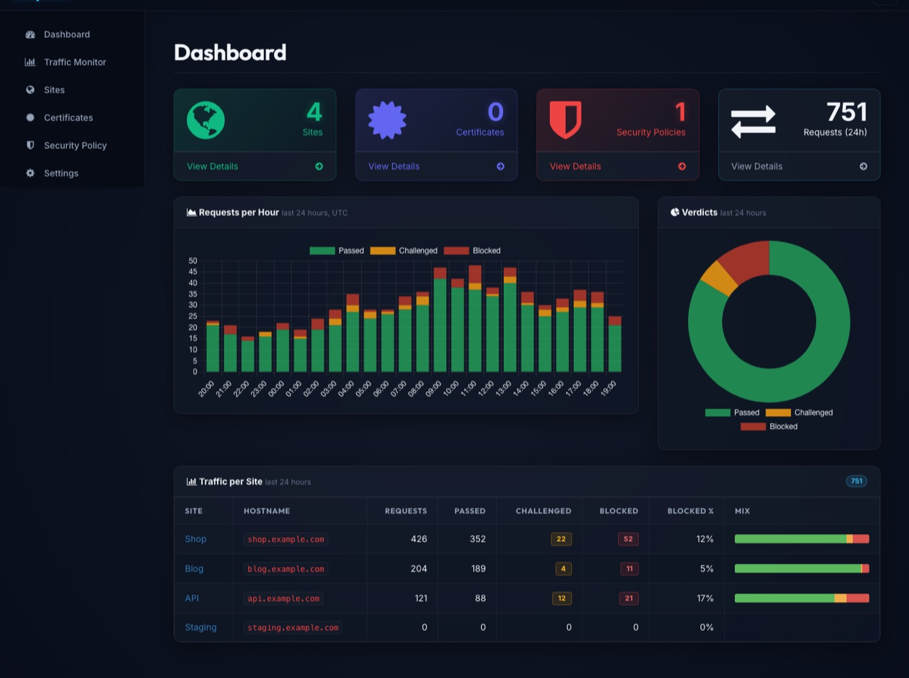

<header class="es-band es-nav">

<a href="." class="es-brand">

EasyWAF
</a>
<nav class="es-nav-links" aria-label="Page sections">
<a href="#protection">Protection</a>
<a href="#visibility">Visibility</a>
<a href="#architecture">Architecture</a>
<a href="#install">Install</a>
<a href="overview/">Docs</a>
</nav>

<a class="es-btn es-btn--secondary" href="https://github.com/easysysio/EasyWAF" target="_blank" rel="noopener noreferrer">
<svg width="16" height="16" viewBox="0 0 16 16" fill="currentColor" aria-hidden="true"><path d="M8 0C3.58 0 0 3.58 0 8c0 3.54 2.29 6.53 5.47 7.59.4.07.55-.17.55-.38 0-.19-.01-.82-.01-1.49-2.01.37-2.53-.49-2.69-.94-.09-.23-.48-.94-.82-1.13-.28-.15-.68-.52-.01-.53.63-.01 1.08.58 1.23.82.72 1.21 1.87.87 2.33.66.07-.52.28-.87.51-1.07-1.78-.2-3.64-.89-3.64-3.95 0-.87.31-1.59.82-2.15-.08-.2-.36-1.02.08-2.12 0 0 .67-.21 2.2.82.64-.18 1.32-.27 2-.27.68 0 1.36.09 2 .27 1.53-1.04 2.2-.82 2.2-.82.44 1.1.16 1.92.08 2.12.51.56.82 1.27.82 2.15 0 3.07-1.87 3.75-3.65 3.95.29.25.54.73.54 1.48 0 1.07-.01 1.93-.01 2.2 0 .21.15.46.55.38A8.013 8.013 0 0016 8c0-4.42-3.58-8-8-8z"></path></svg>
GitHub
</a>
<a class="es-btn es-btn--primary" href="#install">Get started</a>

</header>
<section class="es-band es-hero">

Web application firewall · part of EasySYS

<h1 class="es-h1">A firewall in front of every site you run.</h1>

EasyWAF is a reverse proxy that routes each request to its site, scores it against OWASP-style rules, and then passes it, challenges it or blocks it. Sites, certificates, policies and traffic history are managed from a built-in console and kept in one SQLite file.

<a class="es-btn es-btn--primary es-btn--lg" href="#install">
Get started
<svg width="18" height="18" viewBox="0 0 24 24" fill="none" stroke="currentColor" stroke-width="2" stroke-linecap="round" stroke-linejoin="round" aria-hidden="true"><path d="M12 5v14M6 13l6 6 6-6"></path></svg>
</a>
<a class="es-btn es-btn--ghost es-btn--lg" href="overview/">Read the docs</a>

<svg width="15" height="15" viewBox="0 0 24 24" fill="none" stroke="currentColor" stroke-width="2" stroke-linecap="round" stroke-linejoin="round" aria-hidden="true"><rect x="6" y="6" width="12" height="12" rx="2"></rect><path d="M9 2v4M15 2v4M9 18v4M15 18v4M2 9h4M2 15h4M18 9h4M18 15h4"></path></svg>Rust core
<svg width="15" height="15" viewBox="0 0 24 24" fill="none" stroke="currentColor" stroke-width="2" stroke-linecap="round" stroke-linejoin="round" aria-hidden="true"><path d="M21 8l-9-5-9 5v8l9 5 9-5V8z"></path><path d="M3 8l9 5 9-5M12 13v8"></path></svg>Single binary
<svg width="15" height="15" viewBox="0 0 24 24" fill="none" stroke="currentColor" stroke-width="2" stroke-linecap="round" stroke-linejoin="round" aria-hidden="true"><rect x="4" y="11" width="16" height="10" rx="2"></rect><path d="M8 11V7a4 4 0 018 0v4"></path></svg>TLS by SNI
<svg width="15" height="15" viewBox="0 0 24 24" fill="none" stroke="currentColor" stroke-width="2" stroke-linecap="round" stroke-linejoin="round" aria-hidden="true"><circle cx="12" cy="12" r="9"></circle><path d="M3 12h18M12 3a14 14 0 010 18M12 3a14 14 0 000 18"></path></svg>Offline geolocation

you@laptop — bash

# an ordinary request is forwarded to the app
$ curl -s -o /dev/null -w '%{http_code}\n' \
    "https://shop.example.com/?id=42"
200
# the same request carrying SQL injection is not
$ curl -s -o /dev/null -w '%{http_code}\n' \
    "https://shop.example.com/?id=42'+OR+'1'='1"
403  # blocked, with the matched rules in the Traffic Monitor

Console

:8443 over TLS

State

one SQLite file

Arch

x86_64 · arm64

Packaged for

Debian / Ubuntu
RHEL / Fedora
openSUSE / SLES
Container image
x86_64 · arm64

</section>
<section id="protection" class="es-band es-section">

Protection
<h2 class="es-h2">Route, inspect, decide. Every request, every site.</h2>

A site with no policy is simply a reverse proxy. Attach one and each request is checked against IP lists, country rules and the rule sets before it reaches your application.

<svg width="26" height="26" viewBox="0 0 24 24" fill="none" stroke="currentColor" stroke-width="1.75" stroke-linecap="round" stroke-linejoin="round" aria-hidden="true"><path d="M4 7h11M4 17h11M15 3l4 4-4 4M15 13l4 4-4 4"></path></svg>

/sites

Reverse proxy
<h3 class="es-h3">Routes by host, terminates TLS</h3>

Each request goes to its site's upstream by its Host header. Ports are bound as sites are saved, with no restart, and each site presents its own certificate by SNI, issued and renewed by Let's Encrypt if you like.

Host routingAliasesSNILet's EncryptWebSockets

<svg width="26" height="26" viewBox="0 0 24 24" fill="none" stroke="currentColor" stroke-width="1.75" stroke-linecap="round" stroke-linejoin="round" aria-hidden="true"><path d="M12 3l8 3v6c0 5-3.5 8.5-8 9-4.5-.5-8-4-8-9V6l8-3z"></path><path d="M9 12l2 2 4-4"></path></svg>

/policies

Rules and scoring
<h3 class="es-h3">Anomaly scoring, in three modes</h3>

Each matching rule adds to a score, and the request is blocked when it reaches the policy's threshold. Run a policy Off, in DetectionOnly to record what it would have done, or On.

SQL injectionXSSLFI / RFIRCEScanners

<svg width="26" height="26" viewBox="0 0 24 24" fill="none" stroke="currentColor" stroke-width="1.75" stroke-linecap="round" stroke-linejoin="round" aria-hidden="true"><rect x="3" y="4" width="18" height="16" rx="2"></rect><path d="M7 15l3-3 2 2 5-5"></path><circle cx="17" cy="9" r="1"></circle></svg>

/challenge

Challenge
<h3 class="es-h3">A middle ground between allow and block</h3>

A request that looks automated rather than hostile can be asked to solve a CAPTCHA. It is served by EasyWAF itself, so no visitor is sent to a third-party service.

Self-hosted CAPTCHANo third party

<svg width="26" height="26" viewBox="0 0 24 24" fill="none" stroke="currentColor" stroke-width="1.75" stroke-linecap="round" stroke-linejoin="round" aria-hidden="true"><circle cx="12" cy="12" r="9"></circle><path d="M3 12h18M12 3a14 14 0 010 18M12 3a14 14 0 000 18"></path></svg>

/iplists

Addresses
<h3 class="es-h3">Countries and IP lists</h3>

Allow or block addresses and ranges before any rule runs, and set country rules per policy from a geolocation database compiled into the binary, with nothing to download.

IP allow &amp; block listsCountry rulesOffline

</section>
<section id="visibility" class="es-band es-section es-subtle">

Visibility
<h2 class="es-h2">Know why a request was blocked, and fix a false positive in one click.</h2>

Every proxied request is recorded with its verdict, score, the rules that matched, latency and status. The dashboard shows the mix per site, and the Traffic Monitor takes you down to the single request.

<svg width="22" height="22" viewBox="0 0 24 24" fill="none" stroke="currentColor" stroke-width="1.75" stroke-linecap="round" stroke-linejoin="round" aria-hidden="true"><path d="M8 6h13M8 12h13M8 18h13M3 6h.01M3 12h.01M3 18h.01"></path></svg>

<h3 class="ew-feature-title">Traffic Monitor</h3>

Every request with the rules it matched and the score they added up to. Filter by site, verdict or client, and click a chart to filter by it.

<svg width="22" height="22" viewBox="0 0 24 24" fill="none" stroke="currentColor" stroke-width="1.75" stroke-linecap="round" stroke-linejoin="round" aria-hidden="true"><path d="M2 12s3.5-7 10-7 10 7 10 7-3.5 7-10 7S2 12 2 12z"></path><circle cx="12" cy="12" r="3"></circle></svg>

<h3 class="ew-feature-title">DetectionOnly</h3>

Record what a policy would have blocked or challenged, and block nothing. Try a policy on live traffic before enforcing it.

<svg width="22" height="22" viewBox="0 0 24 24" fill="none" stroke="currentColor" stroke-width="1.75" stroke-linecap="round" stroke-linejoin="round" aria-hidden="true"><path d="M3 5h18l-7 8v6l-4-2v-4L3 5z"></path></svg>

<h3 class="ew-feature-title">One-click exclusions</h3>

Turn a false positive into an exclusion from the traffic row that showed it, narrowed to a site, a path or a single client.

<svg width="22" height="22" viewBox="0 0 24 24" fill="none" stroke="currentColor" stroke-width="1.75" stroke-linecap="round" stroke-linejoin="round" aria-hidden="true"><path d="M12 3l8 3v6c0 5-3.5 8.5-8 9-4.5-.5-8-4-8-9V6l8-3z"></path><path d="M12 8v5M9.5 10.5L12 13l2.5-2.5"></path></svg>

<h3 class="ew-feature-title">Signed rule updates</h3>

Corrected rule sets are published to a signed channel. EasyWAF tells you which policies are behind; applying one is always your decision.

<svg width="22" height="22" viewBox="0 0 24 24" fill="none" stroke="currentColor" stroke-width="1.75" stroke-linecap="round" stroke-linejoin="round" aria-hidden="true"><circle cx="9" cy="8" r="4"></circle><path d="M2 21c0-3.9 3.1-7 7-7s7 3.1 7 7M17 11l2 2 4-4"></path></svg>

<h3 class="ew-feature-title">Accounts and an audit log</h3>

Administrators change things and viewers see them. Every change made through the console is recorded with who made it, when and from where.

<svg width="22" height="22" viewBox="0 0 24 24" fill="none" stroke="currentColor" stroke-width="1.75" stroke-linecap="round" stroke-linejoin="round" aria-hidden="true"><path d="M3 3v18h18"></path><path d="M7 15l4-4 3 3 6-6"></path></svg>

<h3 class="ew-feature-title">Flow logs to EasyLog</h3>

Each request goes out over syslog as one line, to <a href="https://easylog.easysys.io">EasyLog</a> or any collector, for history across many appliances.

</section>
<section id="architecture" class="es-band es-section">

Architecture
<h2 class="es-h2">One binary between the internet and your applications</h2>

One process serves the management console and one proxy listener per site port. Nothing to wire together: no separate database server, and no runtime dependency beyond glibc.

<svg viewBox="0 0 1120 440" role="img" aria-label="Diagram: internet clients reach EasyWAF, which routes each request by host, inspects it against IP lists, country rules and rule sets, and passes it to your web applications or challenges or blocks it. Every request is recorded and sent to EasyLog over syslog. Administrators manage EasyWAF through its console on port 8443.">
<defs>
<marker id="ew-ah" viewBox="0 0 10 10" refX="9" refY="5" markerWidth="7" markerHeight="7" orient="auto-start-reverse"><path class="a-head" d="M0 0L10 5L0 10z"></path></marker>
<marker id="ew-ahb" viewBox="0 0 10 10" refX="9" refY="5" markerWidth="7" markerHeight="7" orient="auto-start-reverse"><path class="a-head a-head--es" d="M0 0L10 5L0 10z"></path></marker>
</defs>
<text class="a-lane" x="0" y="14">CLIENTS</text>
<text class="a-lane" x="300" y="14">EASYWAF</text>
<text class="a-lane" x="900" y="14">BEHIND IT</text>
<g class="a-ext"><rect x="0" y="120" width="220" height="76" rx="10"></rect><text class="a-title" x="20" y="152">Internet clients</text><text class="a-sub" x="20" y="176">browsers · bots · scanners</text></g>
<g class="a-ext"><rect x="0" y="300" width="220" height="76" rx="10"></rect><text class="a-title" x="20" y="332">Administrators</text><text class="a-sub" x="20" y="356">any browser</text></g>
<g class="a-es"><rect x="300" y="30" width="560" height="386" rx="14"></rect><text class="a-title" x="324" y="66">EasyWAF</text><text class="a-sub" x="324" y="90">one binary · one SQLite file</text></g>
<g class="a-box"><rect x="324" y="118" width="150" height="80" rx="10"></rect><text class="a-title" x="340" y="150">Route</text><text class="a-sub" x="340" y="174">by Host header</text></g>
<g class="a-box"><rect x="505" y="118" width="150" height="80" rx="10"></rect><text class="a-title" x="521" y="150">Inspect</text><text class="a-sub" x="521" y="174">lists · rules</text></g>
<g class="a-box"><rect x="686" y="118" width="150" height="80" rx="10"></rect><text class="a-title" x="702" y="150">Verdict</text><text class="a-sub" x="702" y="174">pass · challenge</text></g>
<g class="a-box"><rect x="324" y="292" width="150" height="92" rx="10"></rect><text class="a-title" x="340" y="328">Console</text><text class="a-sub" x="340" y="354">:8443 over TLS</text></g>
<g class="a-box"><rect x="505" y="292" width="331" height="92" rx="10"></rect><text class="a-title" x="523" y="328">Traffic log · audit log</text><text class="a-sub" x="523" y="354">dashboard · Traffic Monitor</text></g>
<g class="a-ext"><rect x="900" y="120" width="220" height="76" rx="10"></rect><text class="a-title" x="920" y="152">Your web apps</text><text class="a-sub" x="920" y="176">any upstream URL</text></g>
<g class="a-es"><rect x="900" y="294" width="220" height="88" rx="10"></rect><text class="a-title" x="922" y="330">EasyLog</text><text class="a-sub" x="922" y="356">flow logs · logfmt</text></g>
<line class="a-line" x1="220" y1="158" x2="322" y2="158" marker-end="url(#ew-ah)"></line>
<text class="a-label" x="232" y="148">HTTP / HTTPS</text>
<line class="a-line" x1="220" y1="338" x2="322" y2="338" marker-end="url(#ew-ah)"></line>
<text class="a-label" x="232" y="328">HTTPS</text>
<line class="a-line a-line--es" x1="474" y1="158" x2="503" y2="158" marker-end="url(#ew-ahb)"></line>
<line class="a-line a-line--es" x1="655" y1="158" x2="684" y2="158" marker-end="url(#ew-ahb)"></line>
<line class="a-line a-line--es" x1="836" y1="158" x2="898" y2="158" marker-end="url(#ew-ahb)"></line>
<text class="a-label a-label--es" x="867" y="148" text-anchor="middle">pass</text>
<line class="a-line" x1="399" y1="292" x2="399" y2="200" marker-end="url(#ew-ah)"></line>
<text class="a-label" x="411" y="250">configures</text>
<line class="a-line a-line--es" x1="761" y1="198" x2="761" y2="290" marker-end="url(#ew-ahb)"></line>
<text class="a-label a-label--es" x="773" y="250">every request</text>
<line class="a-line a-line--es" x1="836" y1="338" x2="898" y2="338" marker-end="url(#ew-ahb)"></line>
<text class="a-label a-label--es" x="867" y="328" text-anchor="middle">syslog</text>
</svg>

EasySYS service
Your existing infrastructure
A request whose Host header matches no site gets a 404, and never reaches an application.

</section>
<section id="install" class="es-band es-section es-subtle">

Deploy
<h2 class="es-h2">Running in minutes. Upgraded like everything else.</h2>

EasyWAF installs from the signed EasySYS package repository, starts on boot under systemd, and upgrades through the package manager you already use. Migrations run at startup, so an upgrade has no separate step. The <a href="install/">installation guide</a> has the details.

1

Add the signed repository

Signed apt, yum and zypper channels, for x86_64 and arm64.

2

Install and enable the service

It starts on boot and serves its console on port 8443.

3

Create your admin, add a site

Point a hostname at its upstream, attach a policy in DetectionOnly, and watch the Traffic Monitor.

<input class="es-os-radio" type="radio" name="es-os" id="es-os-deb" checked />
<input class="es-os-radio" type="radio" name="es-os" id="es-os-rpm" />
<input class="es-os-radio" type="radio" name="es-os" id="es-os-suse" />
<input class="es-os-radio" type="radio" name="es-os" id="es-os-air" />

<label for="es-os-deb">Debian / Ubuntu</label>
<label for="es-os-rpm">RHEL / Fedora</label>
<label for="es-os-suse">openSUSE / SLES</label>
<label for="es-os-air">Container</label>

# 1 — trust the repository
$ curl -fsSL https://repo.easysys.io/easywaf/stable/debian/key.gpg \
    | sudo gpg --dearmor -o /usr/share/keyrings/easysys.gpg
$ echo "deb [signed-by=/usr/share/keyrings/easysys.gpg] \
    https://repo.easysys.io/easywaf/stable/debian ./" \
    | sudo tee /etc/apt/sources.list.d/easywaf.list
# 2 — install and start
$ sudo apt update &amp;&amp; sudo apt install easywaf
$ sudo systemctl enable --now easywaf
# 3 — create your admin
→ https://&lt;host&gt;:8443/

# 1 — trust the repository
$ sudo tee /etc/yum.repos.d/easywaf.repo &gt;/dev/null &lt;&lt;'EOF'
[easywaf]
name=EasyWAF
baseurl=https://repo.easysys.io/easywaf/stable/redhat
enabled=1
gpgcheck=1
gpgkey=https://repo.easysys.io/easywaf/stable/redhat/key.gpg
EOF
# 2 — install and start
$ sudo dnf install easywaf
$ sudo systemctl enable --now easywaf
# 3 — create your admin
→ https://&lt;host&gt;:8443/

# 1 — trust the repository
$ sudo zypper addrepo -fg \
    https://repo.easysys.io/easywaf/stable/redhat easywaf
# 2 — install and start
$ sudo zypper install easywaf
$ sudo systemctl enable --now easywaf
# 3 — create your admin
→ https://&lt;host&gt;:8443/

# multi-arch image; the database lives in /data
$ docker run -d --name easywaf \
    -p 8443:8443 -p 8080:8080 -p 80:80 \
    -v easywaf-data:/data \
    easysysio/easywaf:latest
# publish whichever ports your sites listen on
# create your admin
→ https://&lt;host&gt;:8443/

</section>
<section class="es-band es-cta">

<svg class="es-cta-hex" viewBox="0 0 512 512" aria-hidden="true"><polygon points="86,256 171,109 341,109 426,256 341,403 171,403" fill="none" stroke="#ffffff" stroke-width="34" stroke-linejoin="round"></polygon></svg>

<h2 class="es-h2">Start in DetectionOnly.</h2>

Put EasyWAF in front of one site, let a policy record what it would have blocked, and enforce it once the traffic agrees. Read <a href="limitations/">what EasyWAF does not do</a> first. GPL-3.0 licensed and developed in the open.

<a class="es-btn es-btn--primary es-btn--lg" href="overview/">Read the docs</a>
<a class="es-btn es-btn--on-dark es-btn--lg" href="https://github.com/easysysio/EasyWAF" target="_blank" rel="noopener noreferrer">GitHub</a>

</section>
<footer class="es-band es-footer">

<a href="." class="es-brand">EasyWAF</a>

A web application firewall and reverse proxy in one binary. Part of the <a href="https://easysys.io">EasySYS</a> suite.

Documentation
<a href="overview/">Overview</a>
<a href="install/">Installation</a>
<a href="first-run/">First run</a>
<a href="policies/">Policies and rules</a>
<a href="limitations/">What EasyWAF does not do</a>

EasySYS
<a href="https://easysys.io">easysys.io</a>
<a href="https://easylog.easysys.io">EasyLog</a>
<a href="https://easyvault.easysys.io">EasyVault</a>
<a href="https://easydc.easysys.io">EasyDC</a>
<a href="https://www.easynas.org">EasyNAS</a>

Community
<a href="https://github.com/easysysio/EasyWAF">GitHub</a>
<a href="https://github.com/easysysio/EasyWAF/releases">Releases</a>
<a href="https://repo.easysys.io">Package repository</a>
<a href="https://discord.gg/easysys">Discord</a>

© 2026 EasySYS · GPL-3.0 licensed
easywaf.easysys.io

</footer>

