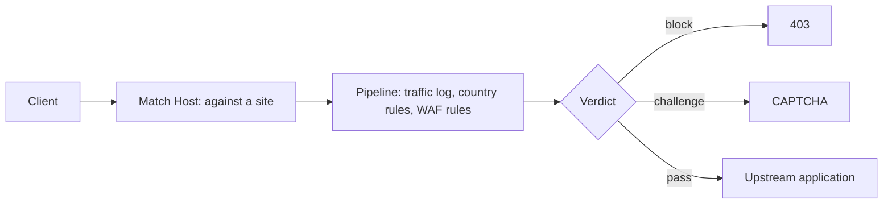

# EasyWAF

**A self-contained web application firewall and HTTP reverse proxy, in a single Rust binary.**

EasyWAF sits in front of your web applications, routes each request to the right
backend by its `Host:` header, inspects it against OWASP-style rules, and then
forwards, challenges or blocks it. Sites, policies, rules, certificates and
traffic history are managed from a built-in web interface and stored in one
SQLite file.

There is no separate database server, no runtime dependency beyond glibc, and
nothing to wire together.

<figure markdown="span">
  { loading=lazy }
  <figcaption>Requests over the last 24 hours, split into passed, challenged and blocked, with a per-site breakdown.</figcaption>
</figure>

---

## How a request is handled

One process serves two things: the **management interface** on port 8443 over
TLS (8080 redirects to it), and **one proxy listener per distinct site port**.
Saving a site on a new port binds it immediately — there is no restart. A
request whose `Host:` matches no enabled site gets a 404.

A site with no policy attached is simply a reverse proxy: traffic is forwarded
and recorded, and the per-site security headers still apply, but nothing is
inspected.

---

## What it does

**Reverse proxy**

- Routes by `Host:` header to any upstream URL, with a site answering for as
  many hostnames as you give it.
- One listener per port, bound as sites are added — no restart.
- HTTPS per site, with certificates selected by SNI, so many sites share one
  HTTPS port and each presents its own. Plain HTTP and HTTPS can be served at
  once, with an optional redirect from one to the other.
- Let's Encrypt certificates, with EasyWAF answering the HTTP-01 challenge
  itself and renewing at 30 days remaining.
- WebSocket upgrades are tunnelled, so terminals, chat and hot reload work.
- Forwarding headers (`X-Forwarded-For`, `X-Real-IP`, `X-Forwarded-Proto`,
  `X-Forwarded-Host`) so the application behind can build correct links.
- Per-site security headers: HSTS, `X-Frame-Options`, `X-Content-Type-Options`,
  `X-XSS-Protection`.

**Firewall**

- Bundled OWASP-style rule sets — SQL injection, XSS, local and remote file
  inclusion, remote code execution, PHP, protocol enforcement and scanner
  detection — plus optional sets for WordPress, Apache, Java and credential
  file exposure.
- Anomaly scoring: each matching rule adds to a score, and the request is
  blocked when the score reaches the policy's threshold. Some rules block
  outright.
- Three modes per policy: `Off`, `DetectionOnly` (record what would have
  happened, block nothing) and `On`.
- A CAPTCHA challenge as the middle ground between allow and block, self-hosted,
  with no third-party service.
- Country rules per policy, using a geolocation database compiled into the
  binary — offline, with nothing to download.
- Rule exclusions, narrowed to a site, a path or a single client, added in one
  click from the traffic row that showed the block.
- Signed rule updates: corrected sets are published to a channel, EasyWAF says
  which policies are behind, and applying is always a decision you make.

**Operating it**

- Traffic Monitor: every proxied request with its verdict, score, the rules that
  matched, latency and status — filterable, with charts that are themselves
  filters.
- Accounts with roles: administrators change things, viewers see them.
- An audit log recording every change made through the interface, and flow logs
  over syslog for a collector such as [EasyLog](https://easysys.io).
- `.deb` and `.rpm` packages for x86_64 and arm64 with a systemd unit, and a
  multi-arch container image.

---

## Where to start

- :material-download: **[Installation](install.md)** — packages, container, and what lands where
- :material-rocket-launch: **[First run](first-run.md)** — the account, the first site, the first policy
- :material-shield-check: **[Policies and rules](policies.md)** — modes, scoring, updates, false positives
- :material-alert-circle: **[What EasyWAF does not do](limitations.md)** — the honest half

!!! tip "Read the limits before deploying"
    [What EasyWAF does not do](limitations.md) is short, current, and the page
    most worth reading before putting this in front of something that matters.
